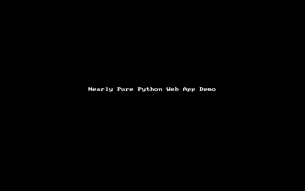

# Nearly Pure Python Web App Demo

## A simple but complete web application skeleton that runs 'out of the box'.

  * No static html, css, or js files
  * Demonstrates how to generate and manipulate html in pure python on both the client and server sides.
  * A useful skeleton that includes Ajax JSON state updates from server to client and vice versa.
  * Automatically reloads server and client pages when any source file changes.
  * Calls a few JS methods directly from Python, hence the 'nearly pure' in the title
  * Powered by Jacques De Hooge's [*Transcrypt™*](https://transcrypt.org/) Python to JS transpiler and Marcel Hellkamp's [*Bottle Python Web Framework.*](http://bottlepy.org/docs/dev/)

### Who's this for?
  * Developers with a taste for minimalism who want to experiment with a (mostly) pure python approach to web app development.
  * Course instructors looking a complete example students can use as a starting point.

### What can I do with it?
  * Fork or clone it as a starting point for your own projects.
  * Read the code. There are only 4 short files with less than 400 sloc total.
  * Stare at the colorful numbers until you grok the message hidden there *just for you*<sup>[1](#hint)</sup></a>.

### Dependencies (install these first)
  * [Python]( https://www.python.org/downloads/) >= 3.5  
  * [Transcrypt™](http://transcrypt.org/) >= 3.6.24
    * `pip install transcrypt`
  * [Bottle](http://bottlepy.org/docs/dev/) >= 0.12.13
      * `pip install bottle`
  * [htmltree](https://github.com/Michael-F-Ellis/htmltree) >= 0.7.5
      * pip install htmltree

### Installation and usage
  ```
    git clone https://github.com/Michael-F-Ellis/NearlyPurePythonWebAppDemo 
    cd NearlyPurePythonWebAppDemo
    ~~python server.py~~
    python allinone.py
  ```
  * Note: You can choose a different server and port. Do `python server.py -h` for details

  * browse to http://localhost:8800 . Your should see a screen like the one below with readout values updating every half-second. Values are color coded as follows:
    * blue:  V <= 2.0 : blue
    * green: 2.0 < V < 8.0 : green
    * red:   V >= 8.0 red

  * Change the Step Size to any number between 0 and 10.
    * Larger values cause faster drifts through color ranges.

  

### Rapid development
Saving a change to any source file triggers a rebuild and reload of the server and the client page. See [Auto Reload](doc/AutoReload.md) for details.

### NEW Single Source File
You can also use the recently added `allinone.py` which combines the content of 3 files into a single one that automatically builds the Javascript and launches the server. Just do `python allinone.py` instead of `python server.py`.  Note that `allinone.py` will likely be the focus of future development and, hence, will probably diverge from the behavior of `server.py + client.py + common.py`.

### Files
Here's what comes from the repository:
```
├── License.md
├── README.md -- This document
├── allinone.py -- Main script
├── client.py (deprecated)
├── common.py (deprecated)
├── doc
│   ├── AutoReload.md
│   ├── example_wsgi.py
│   └── img
│       └── nppwad.gif
├── server.py (deprecated)

```
Ater running `allinone.py` for the first time, files are generated and the directory tree will look like:

```
├── License.md
├── README.md
├── __html__
│   └── index.html
├── __javascript__
│   ├── allinone.js
│   ├── allinone.mod.js
│   └── extra
│       └── sourcemap
│           ├── allinone.js.map
│           └── allinone.mod.js.map
├── allinone.py
├── client.py
├── common.py
├── doc
│   ├── AutoReload.md
│   ├── example_wsgi.py
│   └── img
│       └── nppwad.gif
├── server.py

```

## Parting Thoughts
### The Bad News
While this approach can save you from the frustrations of dealing with .html, .css, and .js syntax, it can't save you from the need to *understand* the Document Object Model, browser events, ajax, http request routing, etc.

### The Good News
If you're already comfortable in Python and understand what goes on in a browser and web server, you can use this skeleton as a starting point for developing entirely in Python.
<hr>
Footnotes

<a name="hint">1</a>: Neuro-chemical assistance may be required. ;-)
