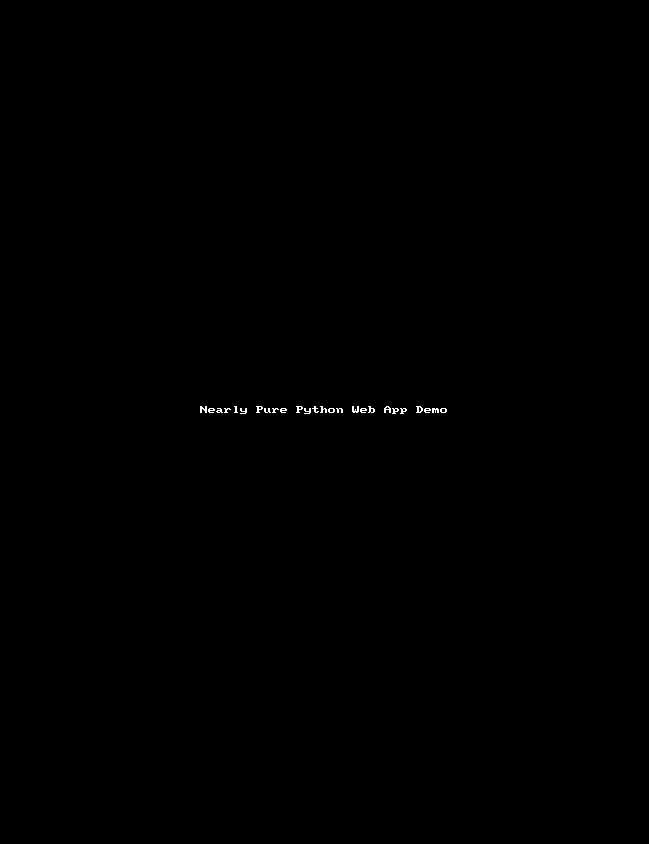

# Nearly Pure Python Web App Demo

## A simple but complete web application skeleton that runs 'out of the box'.

  * No static html, css, or js files
  * Demonstrates how to generate and manipulate html in pure python on both the client and server sides.
  * A useful skeleton that includes Ajax JSON state updates from server to client and vice versa.
  * Automatically reloads server and client pages when any source file changes.
  * Calls a few JS methods directly from Python, hence the 'nearly pure' in the title
  * Powered by Jacques De Hooge's [*Transcrypt™*](https://transcrypt.org/) Python to JS transpiler and Marcel Hellkamp's [*Bottle Python Web Framework.*](http://bottlepy.org/docs/dev/)

### Who's this for?
  * Developers with a taste for minimalism who want to experiment with a (mostly) pure python approach to web app development.
  * Course instructors looking a complete example students can use as a starting point.

### What can I do with it?
  * Fork or clone it as a starting point for your own projects.
  * Read the code. There are only 4 short files with less than 400 sloc total.
  * Stare at the colorful numbers until you grok the message hidden there *just for you*<sup>[1](#hint)</sup></a>.

### Dependencies (install these first)
  * [Python]( https://www.python.org/downloads/) >= 3.5  
  * [Transcrypt™](http://transcrypt.org/) >= 3.6.24
    * `pip install transcrypt`
  * [Bottle](http://bottlepy.org/docs/dev/) >= 0.12.13
      * `pip install bottle`
  * [htmltree](https://github.com/Michael-F-Ellis/htmltree) >= 0.7.5
      * pip install htmltree

### NEW Single Source Files
Use the recently added `allinone.py` which combines the content of 3 files into a single one that automatically builds the Javascript and launches the server. Just do `python allinone.py` instead of `python server.py`. There are also two other new files, `minimal_allinone.py` and `serverless.py`.  These files will likely be the focus of future development and, hence, will continue to diverge from the behavior of `server.py + client.py + common.py` which should now be considered deprecated, or at least discouraged.

### Installation and usage
  ```
    git clone https://github.com/Michael-F-Ellis/NearlyPurePythonWebAppDemo 
    cd NearlyPurePythonWebAppDemo
    python allinone.py
  ```
  * Note: You can choose a different server and port. Do `python allinone.py -h` for details

  * browse to http://localhost:8800 . Your should see a screen like the one below with readout values updating every half-second. Values are color coded as follows:
    * blue:  V <= 2.0 : blue
    * green: 2.0 < V < 8.0 : green
    * red:   V >= 8.0 red

  * Use the slider to change the Step Size to any number between 0 and 10.
    * Larger values cause faster drifts through color ranges.

  

### Rapid development
  * While the app is running, saving a change to any source file triggers a rebuild and reload of the server and the client page. See [Auto Reload](doc/AutoReload.md) for details.
  * Clean pythonic syntax for generating html.  See [htmltree](https://github.com/Michael-F-Ellis/htmltree) docs for details. Here's the function that creates all the body html in the demo above.
```
    def makeBody():
        """
        Create HTML for the body element content. This is done as a demo to show
        that the code in htmltree.py works in Transcrypted JS as well as in Python.
        It could have been accomplished just as easily on the server side.

        Uses JS: .innerHTML
        """
        banner = H1("Nearly Pure Python Web App Demo", style=dict(color='yellow'))
        projectlink = A('Source Code on GitHub',
                        href='https://github.com/Michael-F-Ellis/NearlyPurePythonWebAppDemo')
        subbanner = H2(projectlink)

        header = Div(banner, subbanner, style=dict(text_align='center'))

        ## Each readout is a div containing a meter element and a span to hold
        ## a text representaton of the current value.
        readouts = []
        for datakey in common.statekeys:
            meter = Meter(min="0.1", low="2.0", high="8.0", max="10.0",
                          style=dict(width="25%", margin_top="5px", margin_bottom="5px"))
            value = Span()
            readouts.append(Div(meter, value, _class='readout', data_key=datakey))


        ## The step input is a range slider input with a label on the left and
        ## a span for the current value on the right.
        slider =  Input(id='stepinput', _type='range',
                        min="0.1", max="10.0", step="0.1",
                        style=dict(margin='1em'))

        stepinput = Label("Step Size", slider,
                          style=dict(color='white'))

        ## Make a div container for the step input.
        stepdiv = Div(stepinput,
                      Span(id='stepvalue', style=dict(color="white")),
                      style=dict(margin='20px'))

        ## Assemble header, readouts, and stepdiv within a div
        bodycontent = Div(header)
        bodycontent.C.extend(readouts)
        bodycontent.C.append(stepdiv)

        ## Use the DOM API to insert rendered content
        print(bodycontent.render(0))
        document.body.innerHTML = bodycontent.render()
```
and here is the output `makeBody()` produces:
```
<div>
  <div style="text-align:center;">
    <h1 style="color:yellow;">
      Nearly Pure Python Web App Demo
    </h1>
    <h2>
      <a href="https://github.com/Michael-F-Ellis/NearlyPurePythonWebAppDemo">
        Source Code on GitHub
      </a>
    </h2>
  </div>
  <div class="readout" data-key="item0">
    <meter min="0.1" high="8.0" style="margin-bottom:5px; margin-top:5px;" max="10.0" low="2.0">
    </meter>
    <span>
    </span>
  </div>
  <div class="readout" data-key="item1">
    <meter min="0.1" high="8.0" style="margin-bottom:5px; margin-top:5px;" max="10.0" low="2.0">
    </meter>
    <span>
    </span>
  </div>
  <div class="readout" data-key="item2">
    <meter min="0.1" high="8.0" style="margin-bottom:5px; margin-top:5px;" max="10.0" low="2.0">
    </meter>
    <span>
    </span>
  </div>
  <div class="readout" data-key="item3">
    <meter min="0.1" high="8.0" style="margin-bottom:5px; margin-top:5px;" max="10.0" low="2.0">
    </meter>
    <span>
    </span>
  </div>
  <div class="readout" data-key="item4">
    <meter min="0.1" high="8.0" style="margin-bottom:5px; margin-top:5px;" max="10.0" low="2.0">
    </meter>
    <span>
    </span>
  </div>
  <div class="readout" data-key="item5">
    <meter min="0.1" high="8.0" style="margin-bottom:5px; margin-top:5px;" max="10.0" low="2.0">
    </meter>
    <span>
    </span>
  </div>
  <div class="readout" data-key="item6">
    <meter min="0.1" high="8.0" style="margin-bottom:5px; margin-top:5px;" max="10.0" low="2.0">
    </meter>
    <span>
    </span>
  </div>
  <div class="readout" data-key="item7">
    <meter min="0.1" high="8.0" style="margin-bottom:5px; margin-top:5px;" max="10.0" low="2.0">
    </meter>
    <span>
    </span>
  </div>
  <div class="readout" data-key="item8">
    <meter min="0.1" high="8.0" style="margin-bottom:5px; margin-top:5px;" max="10.0" low="2.0">
    </meter>
    <span>
    </span>
  </div>
  <div class="readout" data-key="item9">
    <meter min="0.1" high="8.0" style="margin-bottom:5px; margin-top:5px;" max="10.0" low="2.0">
    </meter>
    <span>
    </span>
  </div>
  <div style="margin:20px;">
    <label style="color:white;">
      Step Size
      <input style="margin:1em;" max="10.0" type="range" min="0.1" step="0.1" id="stepinput">
    </label>
    <span style="color:white;" id="stepvalue">
    </span>
  </div>
</div>
```
## Starting Smaller
If `allinone.py` is at least somewhat close to where you want to start with development, you can simply make a copy under a new names and start hacking, but you might find a better starting point for your development in one of the two additional skeleton files provided in the repo.

### minimal_allinone.py
This skeleton omits most of the content from allinone.py but retains the server instance, command line options and automatic reloading. The client-server state exchange is also kept but in very minimal form. The display is simply a headline with a counter updating once per second with a count supplied from the server.


### serverless.py
As the name implies, this skeleton has the server code removed. It's a once-through script that generates an index.html file and a js file with Transcrypt. The script finishes by using Python's built-in web browser module to open the index file as a `file://` URL in your default web browser. When the index file loads it fetches and runs the JS. The display is identical in form to the one from `minimal_allinone.py` but the counter updating is handled locally in JS. 


### Files
Here's what comes from the repository:
```
├── License.md
├── README.md -- This document
├── allinone.py -- Main script
├── client.py (deprecated)
├── common.py (deprecated)
├── doc
│   ├── AutoReload.md
│   ├── example_wsgi.py
│   └── img
│       └── nppwad.gif
├── minimal_allinone.py.py
├── server.py (deprecated)
├── serverless.py

```
Ater running `allinone.py` for the first time, files are generated and the directory tree will look like:

```
├── License.md
├── README.md
├── __html__
│   └── index.html
├── __javascript__
│   ├── allinone.js
│   ├── allinone.mod.js
│   └── extra
│       └── sourcemap
│           ├── allinone.js.map
│           └── allinone.mod.js.map
├── allinone.py
├── client.py
├── common.py
├── doc
│   ├── AutoReload.md
│   ├── example_wsgi.py
│   └── img
│       └── nppwad.gif
├── minimal_allinone.py.py
├── server.py
├── serverless.py

```

## Parting Thoughts
### The Bad News
While this approach to development can save you from the frustrations of dealing with .html, .css, and .js syntax, it can't save you from the need to *understand* the Document Object Model, browser events, ajax, http request routing, etc.

### The Good News
If you're already comfortable in Python and understand what goes on in a browser and web server, you can use these skeletons as a starting point for developing entirely in Python.
<hr>
Footnotes

<a name="hint">1</a>: Neuro-chemical assistance may be required. ;-)
